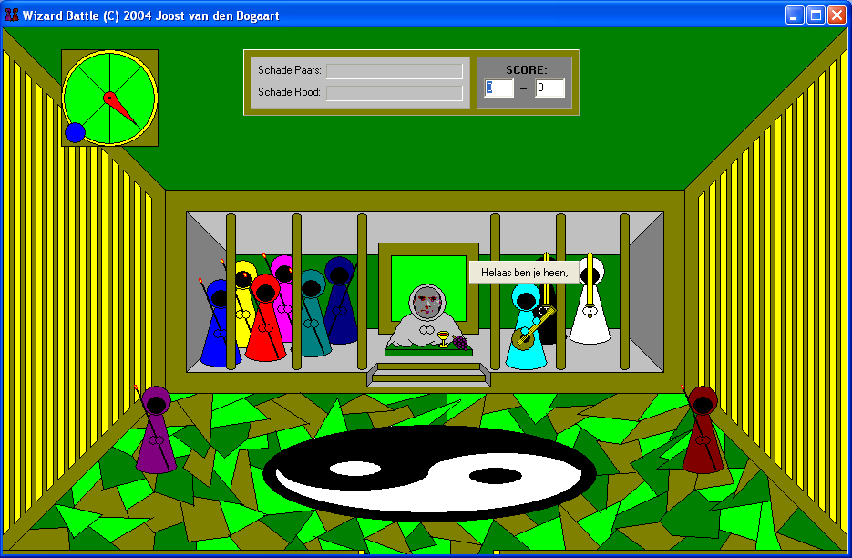

# WizardBattle

Branch|
---|---
`master`|

Wizard Battle is a wizarding fighting game made by Joost van den Bogaart.
 
Wizard Battle is programmed in C++ using the IDE C++ Builder 6.0. It uses the VCL and Boost libraries.

